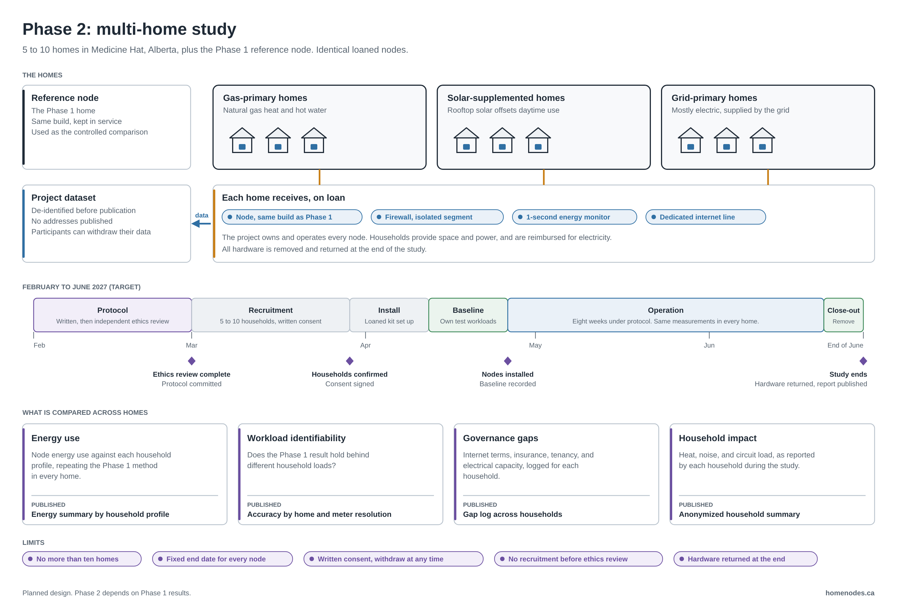

# Phase 2: Multi-Home Study

**Status:** Planning draft. Not started. Depends on Phase 1 results. The full protocol will be written and independently reviewed before any household is recruited.
**Last updated:** 2026-10-09
**Related:** [PHASE-2-BUDGET.md](PHASE-2-BUDGET.md), [ROADMAP.md](ROADMAP.md), [ETHICS.md](ETHICS.md), [Phase 1 overview](https://github.com/homenodes-1/homenodes-poc/blob/main/PHASE-1.md), [RESEARCH-LIMITS.md](https://github.com/homenodes-1/homenodes-poc/blob/main/RESEARCH-LIMITS.md)

## Purpose

Phase 1 measures one node in one home. That cannot separate what is true of residential compute from what is true of that household. Phase 2 repeats the Phase 1 measurements in 5 to 10 Medicine Hat homes with different energy profiles, using identical hardware, so the differences that show up come from the homes.

## Questions

| # | Question | Published output |
|---|---|---|
| 1 | How does node energy use compare across household energy profiles? | Energy summary by profile |
| 2 | Does the Phase 1 identifiability result hold behind different household loads? | Accuracy by home and meter resolution |
| 3 | Which governance gaps repeat across households, and which depend on the home? | Gap log across households |
| 4 | What does hosting a node do to a household: heat, noise, circuit load? | Anonymized household summary |

Question 2 is the detection pathway in the [threat model](drafts/threat-model-v0.1.md). It needs one measurement Phase 1 does not take: electricity use at the household meter. See open decision 1.

## Design

**Households.** Five to ten, recruited in Medicine Hat, spread across three profiles: gas-primary, solar-supplemented, and grid-primary. The Phase 1 home continues as the reference node.

**Hardware.** Each home receives the same kit on loan: a node built to the Phase 1 specification, a firewall, a 1-second energy monitor on the node circuit, and a dedicated internet line whose terms permit hosting. The project owns and operates every node. All hardware is removed when the study ends.

**What households provide.** Space, a suitable electrical circuit, and power. Households are reimbursed for the electricity the node uses.

**Measurements.** The same as Phase 1, in every home: node circuit power, GPU power and utilization, firewall volume and connection counts, and a gap log. Renter workloads are never inspected.

**Comparison.** Identical hardware and identical test workloads in every home. The Phase 1 reference node runs alongside as the controlled comparison.

## Schedule

Target dates. They move if Phase 1 moves.

| When | Stage | What happens |
|---|---|---|
| February 2027 | Protocol | Phase 2 protocol written. Independent ethics review |
| March 2027 | Recruitment | Households recruited. Written consent signed |
| Early April 2027 | Install | Loaned kit installed and checked in each home |
| Late April 2027 | Baseline | The project's own labelled test workloads in every home |
| May to June 2027 | Operation | Eight weeks under protocol |
| End of June 2027 | Close-out | Hardware removed. Results and data published |

## Consent and ethics

- No household is recruited before independent ethics review is complete.
- Participation is by written informed consent. A household can withdraw at any time and have its data removed.
- Data is de-identified before publication. No addresses are published.

The full commitments are in [ETHICS.md](ETHICS.md).

## Limits

- No more than ten homes.
- Every node has a fixed end date.
- No promotion of hosting, and no earnings figures published as an incentive.
- Hardware is loaned and removed at the end.

These come from [RESEARCH-LIMITS.md](https://github.com/homenodes-1/homenodes-poc/blob/main/RESEARCH-LIMITS.md) and apply to every phase.

## Cost

| | Five homes | Ten homes |
|---|---|---|
| Planning estimate (CAD) | About $42,400 | About $80,200 |
| Planning estimate (USD) | About $30,900 | About $58,500 |

Hardware is about two thirds of the total. The line-by-line estimate and its assumptions are in [PHASE-2-BUDGET.md](PHASE-2-BUDGET.md). Research time is unpaid.

## What Phase 2 cannot show

- **It does not test aggregation.** Work split across many nodes and coordinated shutdown are in the threat model. This design does not test either.
- **The sample is small and not random.** Five to ten volunteer households in one city.
- **The hardware is identical.** Real residential hosts run a mix of hardware. Identical nodes make homes comparable, at the cost of realism.

## Open decisions

These are settled in the Phase 2 protocol, before ethics review.

1. **Household meter data.** Whether to collect whole-home interval data from each participant's own utility account, with separate written consent, to answer question 2. Without it, question 2 can only repeat the Phase 1 result. Phase 1 does not collect whole-home energy use.
2. **Payment to households.** Electricity is reimbursed. Whether any payment beyond that is appropriate is a question for the ethics review. The budget carries a placeholder.
3. **Listing on a public platform.** The plan lists Phase 2 nodes as Phase 1 does. Running only the project's own test workloads would lower cost and add no capacity to a marketplace, but would not show real hosting conditions.
4. **Hardware after the study.** What happens to the loaned nodes once they are returned. The decision is published before Phase 2 starts.
5. **Insurance.** Cover for loaned equipment and liability in participants' homes. Not yet quoted.

## Change from the earlier plan

Earlier documents said Phase 2 participants would own their hardware and receive host earnings. Phase 2 now uses project-owned hardware on loan. The project operates the nodes and handles rental income as in Phase 1. This keeps the hardware identical and removes ownership of a GPU as an incentive to take part.
